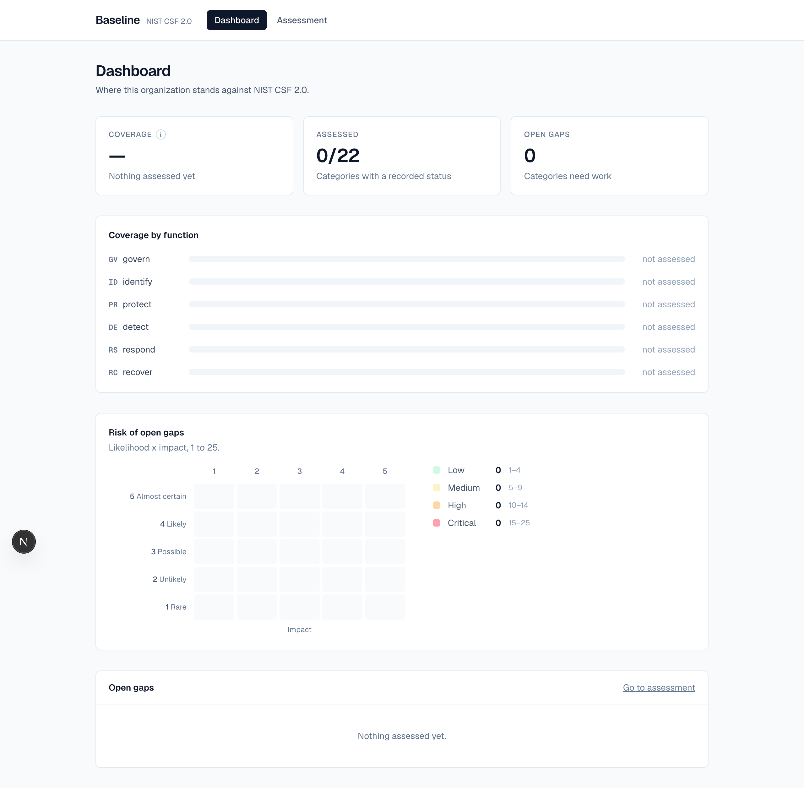
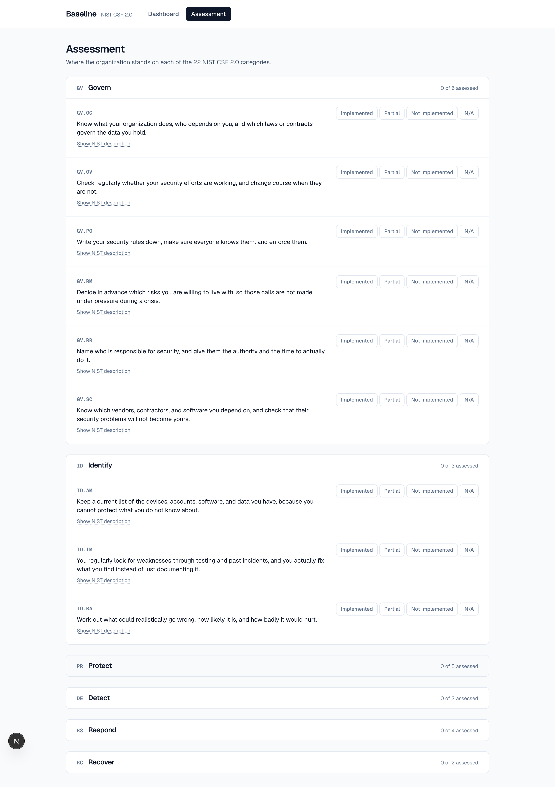

# Baseline

Translates the 22 NIST CSF 2.0 control categories into plain-language explanations, lets
you mark where you stand on each one, and surfaces the gaps by risk score on a dashboard.

## The problem

Small organizations that handle sensitive data get asked to prove their security is
adequate, usually by a partner, a funder, or a customer. Most can't answer. They have
some good practices but nothing that maps them to a recognized standard and nothing that
shows what's missing.

Baseline puts each of the 22 NIST CSF 2.0 categories in plain English, records where you
actually stand on each one, scores every gap on likelihood and impact, and ranks them so
you know what to fix first.

## Screenshots

Dashboard, on a fresh install. Coverage, coverage per function, a 5x5 risk heat map and
every open gap sorted by score. Coverage reads as a dash rather than 0% until something
is assessed, because nothing measured and nothing in place are different answers. The
formula is behind the info icon.



Assessment. All 22 categories grouped under collapsible functions. The plain-English
explanation leads, NIST's wording is one click away. Marking a category not implemented
or partial reveals a likelihood and impact selector with the score shown live. Autosaves,
no submit button.



## What this is not

**Not a commercial GRC platform.** [Vanta](https://www.vanta.com),
[Drata](https://drata.com) and [Secureframe](https://secureframe.com) do this and a lot
more: evidence collection, continuous monitoring, auditor workflows, dozens of
frameworks. CISO Assistant and Eramba are open source and also far more capable. This is
a much smaller single-organization tool.

**Not continuous monitoring.** Nothing is scanned or polled. Every status was typed by a
person and is only current as of the day they typed it.

**Not multi-tenant.** One org per deployment. No login, no user accounts, no
authorization. Anyone who can reach the app can change any answer. Run it locally or
behind something that already handles access.

**Not a substitute for an audit.** Nobody independent checked these answers. Ticking
"implemented" is a claim, not evidence.

**It assesses 22 categories, not the full 106 subcategories.** This is the biggest
scoping decision in the project. NIST CSF 2.0 has 106 subcategories under these 22
categories. 106 questions is more than a small org with no security staff will finish,
and an unfinished assessment gives you no number at all. The 22 categories still cover
every part of the framework, just at lower resolution.

What that costs is precision. A category marked partial tells you access control is
incomplete, but not that MFA specifically is the missing piece. If you need that, you
need the subcategory level, which is a bigger schema and a much longer sitting.

## How gaps are scored

Each gap gets two numbers, 1 to 5.

**Likelihood** is how probable it is that the gap causes a problem: 1 rare, 2 unlikely,
3 possible, 4 likely, 5 almost certain. **Impact** is how bad it would be if it did:
1 negligible, 2 minor, 3 moderate, 4 major, 5 severe. The UI shows those labels, never a
bare number.

Score is likelihood times impact across a 25-cell matrix, and it's computed rather than
stored so it can't drift from its inputs. The 25 cells produce 14 distinct scores, which
fall into four bands.

| Score | Band |
|---|---|
| 1-4 | Low |
| 5-9 | Medium |
| 10-14 | High |
| 15-25 | Critical |

This replaced three subjective priority labels: HIGH, MEDIUM and LOW. One label is a
judgement with nothing under it: two people can disagree and there's no way to reconcile them because there's no
question they were both answering. Two dimensions give two answerable questions, and the
reasoning stays visible in the inputs.

It isn't more precise in any scientific sense. Multiplying two ordinal scales isn't a
measurement, and both numbers are still opinions. What it buys is that the opinion is
decomposed, so you can disagree with one of the two numbers specifically.

The bands are uneven on purpose. The 25 combinations bunch in the middle, so equal-width
bands would put nearly everything in one bucket. The boundaries also mean one high
dimension alone can't reach Critical: 5x1 is Medium and 5x2 is only High. Catastrophic but
almost impossible is a different problem from catastrophic and already happening.

## Tech stack

| Layer | Choice | Why |
|---|---|---|
| Next.js (App Router), TypeScript | Framework | Two screens, almost all reads. Server Components query the database directly and Server Actions handle the writes, so there's no API layer, no REST routes and no client fetch state. |
| SQLite | Database | Under a hundred rows, never concurrent. It's a file, so there's no server to run and a clean clone gives you a working database. |
| Prisma | ORM | The schema is the most interesting file here and needs to be readable. Three models on one page, generated types, migrations committed as SQL you can diff. |
| Tailwind | Styling | No design system to learn. |
| Vitest | Tests | Fast, and the logic worth testing (coverage, risk scoring) is pure functions. |

No chart library. The six coverage bars are styled `div`s with `role="progressbar"`. Six
bars don't justify a dependency and this way they're accessible.

SQLite stops being the right choice as soon as there are concurrent writers, which here
means the moment this goes multi-tenant. It also lives on one filesystem, so it won't
survive a deployment where instances don't share a disk. Postgres is the migration
target. Prisma owns the schema, so that's a provider change rather than a rewrite.

Every decision, including the rejected ones, is in [DECISIONS.md](./DECISIONS.md).

## Running it

```bash
npm install
npx prisma migrate dev    # creates prisma/dev.db and applies the schema
npm run seed              # loads the 22 categories from data/csf-2.0.json
npm run dev               # http://localhost:3000
```

That gives you an empty assessment: all 22 categories loaded, nothing answered.
Open `/assess` and start marking. There is no submit button, so answers save as you
make them.

Other commands:

```bash
npm run verify            # checks the seeded catalog against the NIST source file
npm test                  # 85 tests covering coverage, risk scoring and validation
npm run test:coverage
```

`npm run verify` is the one worth running. It re-reads `data/csf-2.0.json` separately
from the seed and compares it to the database: counts, NIST's function ordering, ID
formats, and all 22 descriptions compared verbatim. That makes "the catalog really is
NIST's" something you can check rather than take my word for.

## Data source

Framework content is NIST Cybersecurity Framework 2.0
([NIST.CSWP.29](https://doi.org/10.6028/NIST.CSWP.29), published 26 February 2024), from
NIST's [Cybersecurity and Privacy Reference Tool](https://csrc.nist.gov/projects/cprt).
US Government work, public domain.

The response is committed verbatim to `data/csf-2.0.json` and you can re-download it with
`./scripts/fetch-catalog.sh`. NIST's category descriptions are stored exactly as
published and never paraphrased.

The plain English explanations in `prisma/seed-plain-language.ts` are not NIST's words. I
wrote them, so anything clumsy in them is mine.

NIST doesn't endorse this tool. "NIST" and "NIST Cybersecurity Framework" appear here
only to identify where the framework content came from.
